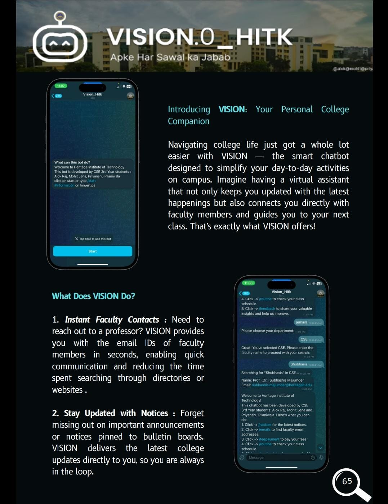
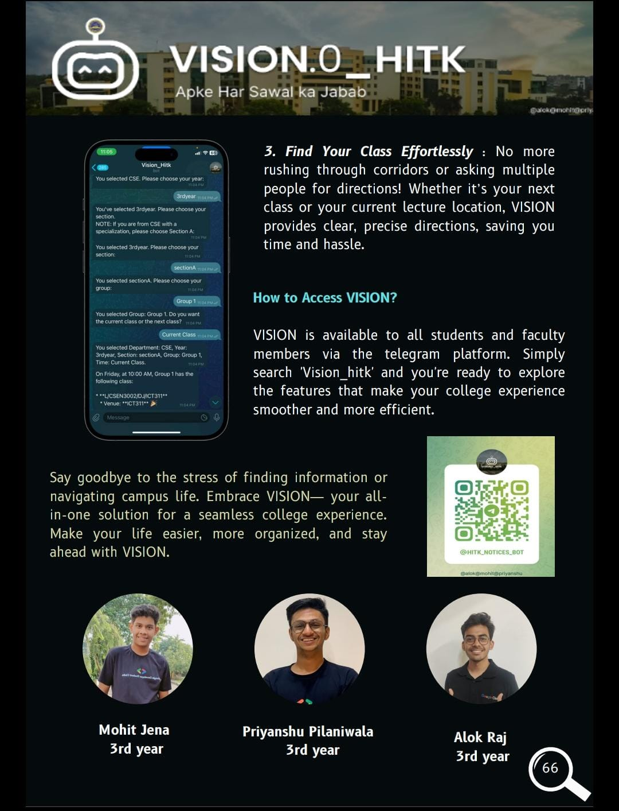

# vision_hitk_DEMO
THIS REPOSITORY IS ONLY FOR VISION_HITK DEMO IMAGES PURPOSE. THE ACTUAL CODE IS PRIVATE FOR CONFIDENTIALITY PURPOSE

# VISION_HITK

vision_hitk is an AI-driven Telegram chatbot that provides instant access to essential information at your fingertips. It is designed to help users stay organized, informed, and prepared by offering quick responses to a variety of needs. Whether you're looking for the latest updates, faculty contact information, or exam preparation materials, this chatbot streamlines the process, making everyday tasks more efficient.

# Features:

1. Instantly receive all recent notices and updates

2. Quickly find faculty email addresses for easy communication.

3. Get information and reminders regarding fee payments.

4. Check your next scheduled class, including subject, faculty,  and classroom details.

5. Access previous year question papers (PYQs) to aid in exam preparation.

